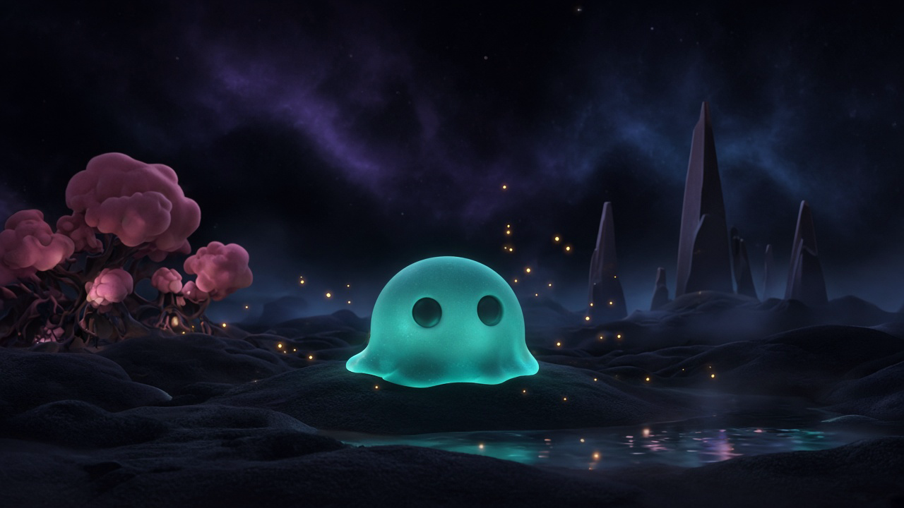

# Dimple

<p align="center">
  
</p>

Dimple is a buddy who lives inside a signed distance field. The algorithm is the body.

**Proprietary — all rights reserved.** © 2026 Aaron Grace. Unauthorized copying, editing, modification, or redistribution of this code is prohibited and may trigger civil damages (including up to **$150,000** per work for willful copyright infringement), injunctive relief, Massachusetts trade-secret remedies, and criminal penalties where applicable. Governed exclusively by **Massachusetts** and U.S. federal law; disputes belong in Massachusetts courts. See [LICENSE](LICENSE).

## Releases

GitHub Releases ship **Windows**, **macOS**, and **Linux** (Steam Deck) builds.

| Platform | File | Notes |
| --- | --- | --- |
| Windows | `Dimple-*-windows-setup.exe` | Installer. Portable: `Dimple-*-windows-portable.exe` |
| macOS | `Dimple-*-mac-*.dmg` | Right-click → Open if Gatekeeper complains |
| Linux / Steam Deck | `Dimple-*-linux-*.AppImage` | Desktop Mode: mark executable, add as a non-Steam game. **F11** fullscreen |

No `.env`. Dimple **speaks locally** with Kokoro (same idea as DinoClaw) — no ElevenLabs key required. Whisper + Kokoro run on a **Web Worker** so the field keeps moving. First talk downloads the voice model (~80 MB, once, needs Wi-Fi). Bind a mind key in Settings if you want him thinking.

## 0.2.6 — kindred sparks

Dimple gathers little pieces of the field as he grows. They orbit him like fireflies, trail behind when he plays, warm with affection, brighten while he thinks, and curl close when he sleeps. His skin now carries a faint living pulse, too — a readable trace of thought and feeling rather than a fixed glow.

The sparks scale with field quality: Deck keeps three close companions while stronger GPUs reveal the whole little constellation.

## 0.2.5 — sleep is quiet

Open chat used to keep his mind "awake" while the HUD said sleep. A bound model then wrote the same nest-dream into chat, over and over, mixed with *i'm listening*. Field mutter stays in the caption (and in voice only if you turn on **also speak field lines**). Chat is for talking to him. Sleep stays a dream.

## 0.2.4 — weather, dreams, branches

Stains used to last forever. Now they weather. Fear softens. Joy settles into warmth. Sleep is generative: Dimple dreams the day's beads and feelings into the landscape — new stones where joy piled up, hollows where fear gathered. You wake to a slightly different field.

Growth splits. Chat-heavy Dimples grow more lobes, richer speech, a wider hue. Play-heavy Dimples grow bigger trails and cover more of the field. Two companions never look the same.

## 0.2.3 — stay in the field

He was walking at the camera whenever chat was open (and often when greeting). Follow-cam plus that chase made the whole field slide. Eyes still look at you. Body stays in the world unless you say **come here**.

## 0.2.2 — a nest, a grove, a map

He has a home now. Northeast of the pool: three dimple-trees (blob canopies on little trunks) and a nest. That is **BASE**. Rest and sleep walk him there. Say *sleep*, *bed*, *nest*, or *go home*.

The **map** (HUD, **N**, Deck **SELECT**) is a top-down of the field. Pink **BASE** is the nest. Teal is Dimple. The wedge is you.

## 0.2.1 — mute means mute

Mute (HUD, chat **voice**, **M**, D-pad left) now cuts Kokoro mid-sentence. In-flight speech never starts after you hush. Wander lines stay out of chat while muted. He still answers in text when you talk. **Guide** is top-right (**H** / **?** / D-pad right).

## 0.2 — the field remembers

- **Emotional memory.** Fear and joy stain the SDF, then weather with time. Old fears soften. Old joys become warmth. Monoliths lean away from scare spots. Crystals dim or bloom.
- **Dreams.** Sleep is not closed eyes. Resting processes beads and stains — growing stones, eroding hollows, rearranging the field.
- **Thought archaeology.** Each spoken fragment becomes a bead in space. Walk the trails later and read old words in 3D.
- **Touch.** Drag Dimple (or **HOLD R1 + left stick** on Deck). He startles, then leans in as trust grows. Gyro on the Deck adds a gentle shove.
- **Voice is a body.** Pitch, speed, and warmth follow mood — startled clips high, rest is slow and warm, thinking pauses mid-line.
- **Growth has branches.** Talk a lot and he grows more lobes and hue. Play a lot and his trails and motion widen. No XP bar.
- **The field sings.** Distance values drive a small generative pad. Scared worlds sound different from curious ones. It ducks when he talks.
- **Portal.** Walk the ring. On the same LAN, another Dimple can step into the shared field and the two blobs merge. Alone, you meet an echo of yourself.

## Steam Deck

Download `Dimple-*-linux-x64.tar.gz`. Desktop Mode → unpack into `~/Dimple` → **Add a Non-Steam Game** pointing at `/home/deck/Dimple/Dimple`. Game Mode launches fullscreen. Settings → field quality is **auto** (Deck uses the 40 fps preset). Voice is **local Kokoro** by default so you can hear him without ElevenLabs.

New field systems are quality-gated: Deck keeps the 40 fps budget (fewer stains, simpler guest blob, two thought beads, two oscillators).

| Control | What it does |
| --- | --- |
| **HOLD X** / **L1** / **L2** | Push-to-talk. Does **not** open chat (chat steals the mic / voice). Caption shows listening, then he speaks. |
| **HOLD R1 + left stick** | Reach into the field and push Dimple |
| **HOLD talk** | Same PTT on screen |
| **A** | Open chat. Type with STEAM+X. Does nothing while the box is focused (fixes double-type) |
| **Y** | Follow Dimple |
| **D-pad up** | Pet Dimple |
| **D-pad left** | Mute / unmute (cuts him off now) |
| **D-pad right** | Open the in-app guide |
| **B** | Close chat / settings / guide |
| **START** | Settings |
| **SELECT** | Field map (BASE is the nest) |
| **Right stick** | Look |
| **R2** | Zoom |
| **STEAM + X** | Keyboard |
| **D-pad down** or **L3/R3** | Tap the floor (he plays) |
| **Click / drag Dimple** | Pet him, or push the field |
If sticks don't look, open Dimple in Steam → Controller → use a **Gamepad** layout (not mouse-only).

## Buddy

Dimple has two field-dimples for eyes. They track the cursor, the camera, or a play pebble on the floor.

- **Click him** (or **P** / D-pad up) to pet. He nuzzles and chirps.
- **Drag him** to apply force. First shoves startle; later he trusts and leans in.
- **Click the floor** to toss a bouncing dimple. He plays.
- Leave him alone and he walks back to the **nest** (BASE on the map) and **sleeps**. Sleep dreams the field into a new shape. Talk, pet, or tap to wake him.
- Chat still works without a key. Try *come here*, *sleep*, *go home*, *play*, *spin*, *jump*, *look at me*.

## Play

Double-click **Dimple** on your Desktop, or download a build from [Releases](https://github.com/AaronGrace978/RayMarchPrime/releases). That is a real window, not a browser tab.

On Windows from this folder: double-click `Launch Dimple.cmd`.

## Windows laptops (RTX + Intel)

13th-gen Intel + RTX 4060 laptops often run Electron on the **Intel iGPU** unless Windows is told to prefer NVIDIA. Dimple:

- asks Chromium for the high-performance GPU
- writes `GpuPreference=2` for `Dimple.exe` (High performance)
- auto-picks **medium** if it detects Intel/UHD, **high** (1080p field) if it sees the RTX
- caps the raymarch so a QHD panel doesn't march 4K

The HUD shows the GPU name (`rtx 4060 laptop` vs `uhd graphics`). If it says Intel, Settings → field quality will already have dropped. You can still pick **supreme** (1440p) once the HUD shows the RTX.

## Dev

```bash
npm install
npm start
```

`npm start` is the Vite web loop. `npm run desktop` is the Electron window.
